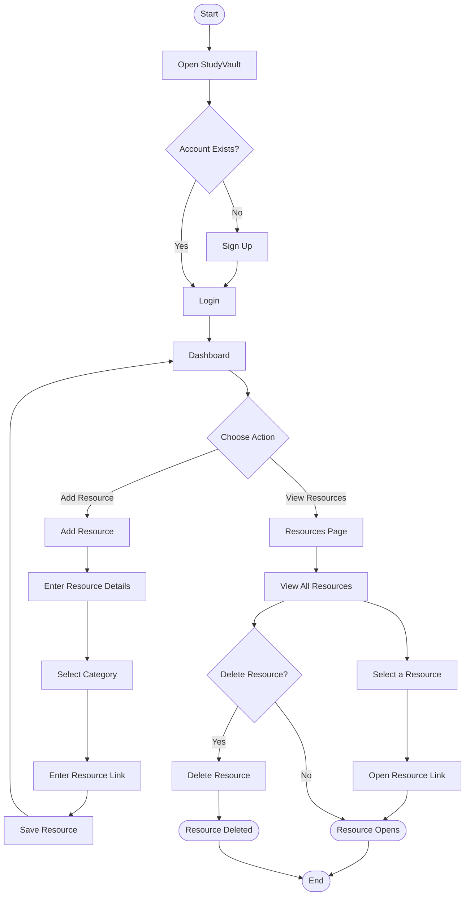

# StudyVault

## Introduction

StudyVault is a MERN-based student resource management platform designed to provide students with a simple and organized way to access and manage academic resources in one place.

Students can add, view, and manage educational resources such as notes, assignments, past papers, videos, and documents. Each resource includes an active link that allows users to directly access the original learning material.

## Features

- User Signup and Login
- Secure Authentication
- Student Dashboard
- Add Study Resources
- View All Resources
- Resource Categories
- Notes, Assignments, Past Papers, Videos, and Documents
- Active Resource Links
- Direct Access to Documents and Videos
- Delete Resources
- Organized Resource Management
- Clean and Responsive User Interface

## User Flow

## Tech Stack

### Frontend
- React.js
- HTML
- CSS
- JavaScript

### Backend
- Node.js
- Express.js

### Database
- MongoDB
- Mongoose

## Project Purpose

The purpose of StudyVault is to provide students with a centralized platform where they can easily access and manage useful academic resources without having to search through multiple platforms.

## Author

**Zobia Masood**
